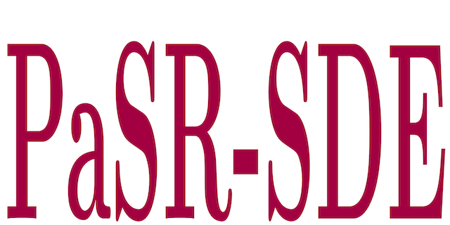
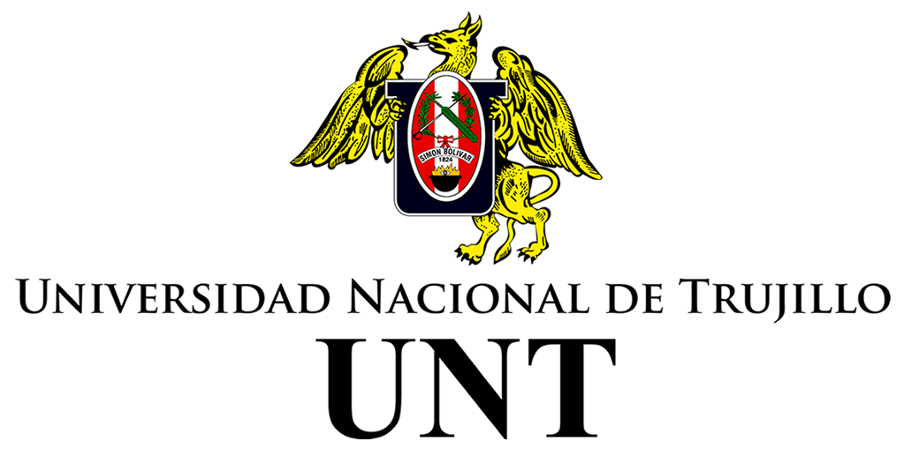
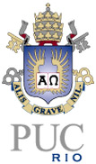
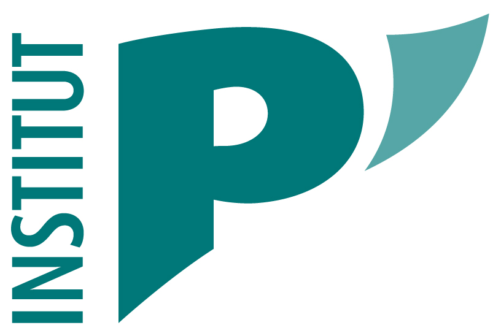

**PaSR-SDE: Premixed Turbulent Combustion with Stochastic Mixing Models Simulator** is a Matlab code to simulate premixed turbulent combustion in a partially stirred reactor using stochastic micro-mixing models.

## Documentation

**PaSR-SDE** routines are commented to explain their functionality to the final user. Each routine has a short description of its purpose and a list of inputs and/or outputs.

## Software History

**PaSR-SDE** development started in the first author master thesis in 2007, under suppervision of the second author. The underlying results were disclosed in the following publication:
- *E. M. Orbegoso and L. F. Figueira da Silva, Study of stochastic mixing models for combustion in turbulent flows, Proceedings of the Combustion Institute, v. 32, pp. 1595-1603, 2009 http://dx.doi.org/10.1016/j.proci.2008.06.008*

The development resumed in 2023, with the last author updating the code to make it compatible with newer versions of Matlab.

## Reproducibility

Simulations done with **PaSR-SDE** are fully reproducible, as can be seen on this <a href="https://codeocean.com/capsule/3034874/tree/v1" target="_blank">CodeOcean capsule</a>

## Authors
- Elder Mendoza Orbegoso (UNT)
- Luis Fernando Figueira da Silva (PUC-Rio / Institut Pprime)
- Americo Cunha Jr (UERJ)

## Citing PaSR-SDE

We kindly ask users to cite the following references in any publications reporting work done with **CRFlowLib**:
- *E. M. Orbegoso and L. F. Figueira da Silva, Study of stochastic mixing models for combustion in turbulent flows, Proceedings of the Combustion Institute, v. 32, pp. 1595-1603, 2009 http://dx.doi.org/10.1016/j.proci.2008.06.008*
- *E. M. Orbegoso, L. F. Figueira da Silva and A. Cunha Jr, PaSR-SDE: A Matlab Package for Premixed Turbulent Combustion Stochastic Mixing Models, 2023*

```
@article{Orbegoso2009p1595,
   author  = {E. M. Orbegoso and L. F. {Figueira da Silva}},
   title   = {Study of stochastic mixing models for combustion in turbulent flows},
   journal = {Proceedings of the Combustion Institute},
   year    = {2009},
   volume  = {32},
   pages   = {1595-1603},
   doi     = {10.1016/j.proci.2008.06.008},
}
```

```
@article{Orbegoso2023PaSR-SDE,
   author  = {E. M. Orbegoso and L. F. {Figueira da Silva} and A. {Cunha~Jr}},
   title   = "{PaSR-SDE: Premixed Turbulent Combustion with Stochastic Mixing Models Simulator}",
   journal = {~},
   year    = {2023},
   volume  = {~},
   pages   = {~},
   doi     = {~},
}
```

## License

**PaSR-SDE** is released under the MIT license. See the LICENSE file for details. All new contributions must be made under the MIT license.

 

## Institutional support

 &nbsp; &nbsp;  &nbsp; &nbsp;  &nbsp; &nbsp; 

## Funding

 &nbsp; &nbsp;  &nbsp; &nbsp; 
