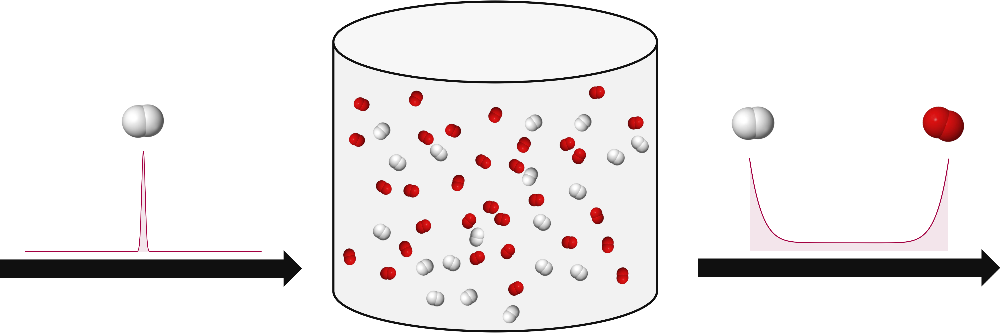

## Premixed Turbulent Combustion with Stochastic Mixing Models Simulator

**PaSR-SDE: Premixed Turbulent Combustion with Stochastic Mixing Models Simulator** is a Matlab code designed to simulate premixed turbulent combustion in a partially stirred reactor using stochastic micro-mixing models.

<p align="center">

</p>

## Table of Contents
- [Overview](#overview)
- [Features](#features)
- [Usage](#usage)
- [Documentation](#documentation)
- [Reproducibility](#reproducibility)
- [Authors](#authors)
- [Citing PaSR-SDE](#citing-pasr-sde)
- [License](#license)
- [Institutional support](#institutional-support)
- [Funding](#funding)

## Overview
**PaSR-SDE** provides a robust framework for simulating premixed turbulent combustion using stochastic mixing models in a partially stirred reactor. This simulator is useful for researchers studying combustion in turbulent flows.

**PaSR-SDE** development started in the first author master thesis in 2007, under suppervision of the second author. The underlying results were disclosed in the following publication:
- **E. M. Orbegoso and L. F. Figueira da Silva**, *Study of stochastic mixing models for combustion in turbulent flows*, Proceedings of the Combustion Institute, v. 32, pp. 1595-1603, 2009  <a href="http://dx.doi.org/10.1016/j.proci.2008.06.008" target="_blank">DOI</a>

The development resumed in 2023, with the last author updating the code to make it compatible with newer versions of Matlab.

## Features
- Simulates premixed turbulent combustion using stochastic micro-mixing models
- Well-documented code with detailed comments
- Educational style for ease of use
- Includes example scripts for representative benchmark tests

## Usage
To get started with **PaSR-SDE**, follow these steps:
1. Clone the repository:
   ```bash
   git clone https://github.com/americocunhajr/PaSR-SDE.git
   ```
2. Navigate to the code directory:
   ```bash
   cd PaSR-SDE/PaSR-SDE-2.0
   ```
3. To simulate a PaSR reactor, execute:
   ```bash
   Main_PaSR_Simulation
   ```

### Documentation
**PaSR-SDE** routines are commented to explain their functionality. Each routine includes a short description of its purpose and a list of inputs and outputs. Users can refer to the example scripts provided to understand how to set up and run their simulations.

### Reproducibility
Simulations done with **PaSR-SDE** are fully reproducible, as can be seen on this <a href="https://codeocean.com/capsule/3034874/tree/v1" target="_blank">CodeOcean capsule</a>

### Authors
- Elder Mendoza Orbegoso (UNT)
- Luis Fernando Figueira da Silva (PUC-Rio / Institut Pprime)
- Americo Cunha Jr (UERJ)

### Citing PaSR-SDE
If you use **PaSR-SDE** in your research, please cite the following references:
- *E. M. Orbegoso and L. F. Figueira da Silva, Study of stochastic mixing models for combustion in turbulent flows, Proceedings of the Combustion Institute, v. 32, pp. 1595-1603, 2009 http://dx.doi.org/10.1016/j.proci.2008.06.008*
- *E. M. Orbegoso, L. F. Figueira da Silva and A. Cunha Jr, PaSR-SDE: A Matlab Package for Premixed Turbulent Combustion Stochastic Mixing Models, Software Impacts, v. 15, pp. 100480, 2023 http://dx.doi.org/10.1016/j.simpa.2023.100480*

```
@article{Orbegoso2009p1595,
   author  = {E. M. Orbegoso and L. F. {Figueira da Silva}},
   title   = {Study of stochastic mixing models for combustion in turbulent flows},
   journal = {Proceedings of the Combustion Institute},
   year    = {2009},
   volume  = {32},
   pages   = {1595-1603},
   doi     = {10.1016/j.proci.2008.06.008},
}
```

```
@article{Orbegoso2023PaSR-SDE,
   author  = {E. M. Orbegoso and L. F. {Figueira da Silva} and A. {Cunha~Jr}},
   title   = "{PaSR-SDE: Premixed Turbulent Combustion with Stochastic Mixing Models Simulator}",
   journal = {Software Impacts},
   year    = {2023},
   volume  = {15},
   pages   = {100480},
   doi     = {10.1016/j.simpa.2023.100480},
}
```

### License
**PaSR-SDE** is released under the MIT license. See the LICENSE file for details. All new contributions must be made under the MIT license.

 

### Institutional support

 &nbsp; &nbsp;  &nbsp; &nbsp;  &nbsp; &nbsp;  

### Funding

 &nbsp; &nbsp;  &nbsp; &nbsp; 
